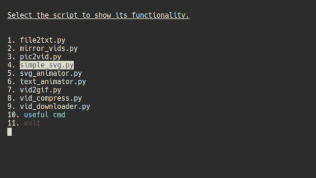
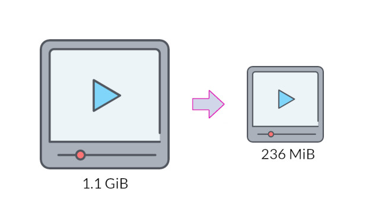
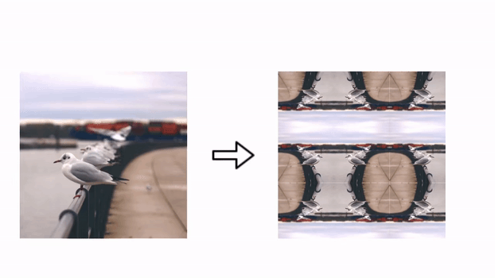

# Video Editing Python Scripts

We present here multiple (easy to use) python based scripts used for video and image editing.
These scripts work in Linux and Windows. MacOS is not supported,
but these scripts should also work on macOS because python is a system agnostic language.

- [The Scripts usage](#The-Scripts-usage)
	+ [cmd_help](#cmd_help)
	+ [vid_compress](#vid_compress)
	+ [vid_downloader](#vid_downloader)
	+ [pic2vid](#pic2vid)
	+ [simple_svg](#simple_svg)
	+ [svg_animator](#svg_animator)
	+ [file2txt](#file2txt)
	+ [vid2gif](#vid2gif)
	+ [text_animator](#text_animator)
	+ [mirror_vids](#mirror_vids)

- [Prerequisites](#Prerequisites)
	+ [ffmpeg](#ffmpeg)
	+ [youtube-dl](#youtube-dl)
	+ [python packages](#python-packages)

- [How to Install and Use](#How-to-Install-and-Use)
    + [Simple usage](#Simple-usage)
    + [Make scripts global for Linux](#Make-scripts-global-for-Linux)
    + [Make scripts global for Windows](#Make-scripts-global-for-Windows)

# The Scripts usage

We present in the following the different scripts provided by this repository.
To show information about any script, execute ```<SCRIPT_NAME>.py --help```

## cmd_help



This script shows a list that contains all other scripts,
and let you select which one you want to use to display its help.
So, this is the only command you need to **memorize**.
To use it, just execute:

```
cmd_help.py
```

## vid_compress



Compresses videos using ffmpeg,
also provides multiple options in order to change the resulting videos like dimension change or sound removal.

example:

```
vid_compress.py --fps 25 --scale 720 --keep --rm_audio -i birds.mp4
```

This command will take 'birds.mp4' video as an input and compress it,
the resulting video will have 25 frames per second,
will be scaled to 720p and its audio will be removed,
its compression will be done using the famous H.264 codec.
For more information about codecs that can be used:

```
vid_compress.py --codec help
```

## vid_downloader


Downloads video or part of a video using youtube-dl and ffmpeg.
For example:

```
vid_downloader.py -t 0.00.00 0.00.02 -u https://www.youtube.com/watch?v=PCicKydX5GE
```

This command will download the part from **0 h 00 m 00s** to **0h 00 m 02s** of this YouTube [video](https://www.youtube.com/watch?v=PCicKydX5GE).

## pic2vid


Search for images in the current directory and convert them to video, all images must have the same dimensions.
The number of images shown per second is calculated using the provided duration.

For example:

```
cd my_pictures; pic2vid.py --duration 4 --extension .jpg --fps 25
```

This command will go to directory 'my_pictures', and it will merge any '.jpg' images into one video with the duration of 4 seconds,
and 25 frames per second. The number of images shown in each second depends on the number of images and the specified duration.


## simple_svg


Generate simple shape in the form of SVG file.

For example:

```
simple_svg.py --color "#00cc99" --size 600 400 --shape elliple --thickness 15
```

This command will produce an SVG file with an ellipse drawn in the center,
with the color #00cc99, of the size 600x400 and a line thickness of 15.

This one will also produce a command that you can use with svg_animator.py to animate the shape,
You just have to past the command using Ctrl+V and hit Enter (you need to have 'xclip' installed)

## svg_animator


Create a line animation video from a SVG file, the supported shapes are: path, ellipse, circle and rect. Only the first shape presented in the file is animated.

For example:

```
svg_animator.py --input ellipse.svg -c 0,204,153 -w 13 -t --num_frames 150 --fps 30
```
This command will take the 'ellipse.svg' file as an input.
And it will produce a video of 5 seconds (150 number_of_frames / 30 FPS = 5 seconds).
The color of the used line is RGB(0,204,153) and a width of 13.

## file2txt


Transforms files to text and vise-versa. Useful to embed images inside code, for example.

For example:

```
file2txt.py -i flower_icon.png -p
```

This will transform 'flower_icon.png' into a text that you can embed in your program.


## vid2gif


Converts videos to GIFs. Multiple optimization option are provided.

For example:

```
vid2gif.py -i birds.mp3 -f 12 -s 300
```

This command will take the birds.mp3 video and transform it to a GIF with 12 frames per second,
and an image width of 300  pixels.

## text_animator


Create a text typing animation video with a transparent background.
The font size is calculated automatically from the text_bbox variable

For example:

```
text_animator.py -i "computer can also type" --length 3 --antialiasing -c 255,0,0 --text_bbox 550 300
```

This command will produce a video with a transparent background of 3 seconds length.
In this video, the sentence 'computer can also type' is animated.
The color of the text will be red, and it will have the default size of 600x600 pixels.
The script will try to fit the text in the text bounding box of 550x300 pixels,
and it will calculate the font size automatically.

## mirror_vids



Create array of video, could be horizontally or vertically or both, stacked videos are flipped.
Useful to perform video transition animation.

For example:

```
mirror_vids.py -i bird.mp3 -o bird_mirrors.mp3
```

This command will take 'bird.mp3' and produce a video of 8 copies of the initial video stacked around the initial video.

# Prerequisites

In this section, we present multiple packages that need to be installed before running the scripts.
On Linux, you can use your command line favorite package manager.
In our example, we will use Aptitude (```apt-get``` Ubuntu based).

On Windows, the best option is to use a command line package manager.
We advise using **scoop** from [https://scoop.sh/](https://scoop.sh/) (a good alternative to scoop is **[Chocolatey](https://chocolatey.org/install)**).

To install **scoop** type the following commands in PowerShell (open Explorer then ALT+F+S+R):

```
Set-ExecutionPolicy RemoteSigned -Scope CurrentUser
irm get.scoop.sh | iex
```

## ffmpeg

[FFmpeg](https://www.ffmpeg.org/) is a command line video editing program. And it is used by almost all scripts provided by this repository.

On linux, type:

```
sudo apt install ffmpeg
```

On windows, type:

```
scoop install ffmpeg
```


## youtube-dl

[Youtube-dl](https://github.com/ytdl-org/youtube-dl) is a package used to download videos from YouTube.com (and a few more sites) using command line.

On linux, type:

```
sudo apt install youtube-dl
```

On windows, type:

```
scoop install youtube-dl
```


## python packages

Here is the list of the Python packages used in the different scripts:

colorama
svg.path
Pillow

To install these package, execute the following commands:

```
python3 -m pip install --upgrade pip
python3 -m pip install --upgrade Pillow
python3 -m pip install --upgrade colorama
python3 -m pip install --upgrade svg.path
```

# How to Install and Use

## Simple usage

Once the Prerequisites packages are installed, the scripts can be used once you give them execution permission on Linux.

The simplest way to use a script is to put it in the folder you want to use and then execute it.
However, we advise against this. We show in the following sections how to make the scripts global,
so that they can be used from anywhere in your system.

## Make scripts global for Linux

* Firstly, download the GitHub repo using ```git clone``` or download and unpack the zip file.

* Copy the 'Scripts' folder to your preferred directory, in our case we will put it in the home folder, use the following command:

```cp -r video-editing-py-script/Scripts/ ~/Scripts```

* Give the python scripts execution permission, use the following command:

```cd ~/Scripts; chmod +x *.py```

* Add the 'Scripts' to your Global paths. For bash terminal, use the following command:

```echo 'export PATH=$PATH:"$HOME/Scripts"' >> ~/.bashrc```

* To test if everything is ok. Open a new terminal. Type the following command, and it should show a list of available scripts:

```cmd_help.py```


## Make scripts global for Windows

Coming soon ...

